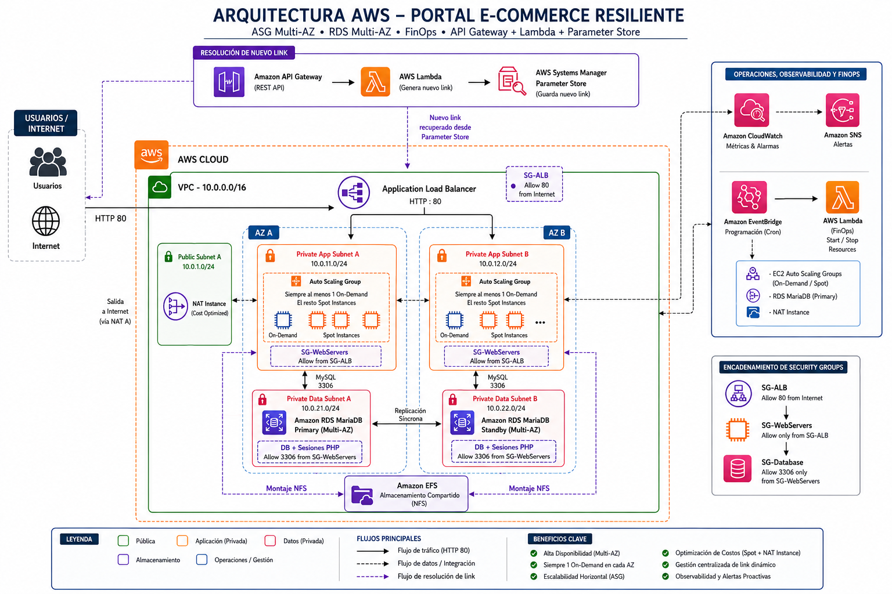

# 🛒 Resilient & Stateless E-Commerce Architecture (Three-Tier)

A production-grade, highly available, and fault-tolerant 3-Tier Web Architecture deployed on AWS. Designed with strict security (SG chaining), stateless application nodes, and aggressive FinOps cost-optimization strategies.

## 🏗️ Architecture Diagram

## 📖 The Story (STAR Method)

### Situation
A fast-growing e-commerce startup was running its entire web stack on a single, oversized EC2 instance. They suffered from severe scalability issues during month-end sales (crashing under heavy load) and experienced a critical 4-hour downtime incident due to underlying hardware failure, resulting in significant revenue loss.

### Task
Design and implement a classic Highly Available (HA) Three-Tier Architecture that auto-scales dynamically with traffic, survives Availability Zone (AZ) failures gracefully, and maintains strict cost controls (FinOps).

### Action
I architected a decoupled, secure, and stateless infrastructure:
1. **Network & Security:** Built a custom VPC across 2 AZs. Implemented **Security Group Chaining**, ensuring the EC2 instances only accept traffic from the Application Load Balancer (ALB), and the RDS database only accepts port 3306 traffic from the EC2 security group.
2. **Stateless Compute Tier:** Migrated the monolithic PHP application to an **Auto Scaling Group (ASG)** in private subnets. 
   - Decoupled file storage using **Amazon EFS**.
   - Decoupled PHP session management by injecting a custom database handler to store sessions in **MariaDB**, enabling seamless user navigation across ephemeral EC2 instances.
3. **Data Tier:** Deployed Amazon RDS MariaDB in **Multi-AZ** mode for synchronous replication and automated failover.
4. **Resiliency Testing (Chaos Engineering):** Validated the ASG's Target Tracking scaling policy by simulating real-world traffic via `RequestCountPerTarget`. Furthermore, I used **AWS Systems Manager (SSM) Run Command** to inject CPU and RAM stress (`stress` tool), successfully triggering a CloudWatch/SNS alarm that activated an emergency Step Scaling fallback policy.
5. **FinOps & Cost Optimization:** - Prioritized Spot Instances within the ASG.
   - Replaced the expensive managed NAT Gateway with an ARM-based `t4g.nano` EC2 **NAT Instance** (`fck-nat`).
   - Implemented an **EventBridge -> Lambda** automation to completely shut down the ALB, ASG, RDS, and NAT instance outside of business hours, drastically reducing the monthly AWS bill.

### Result
- **High Availability:** Achieved a resilient architecture capable of surviving an AZ failure with zero data loss.
- **Scalability:** The platform now scales horizontally based on actual HTTP request loads, handling traffic spikes effortlessly.
- **Cost Efficiency:** Infrastructure costs were reduced by using Spot instances, ARM Graviton processors, and automated nocturnal shutdowns.

## 📂 Repository Structure
* `/docs`: Contains the architecture diagram and the `architecture.md` Mermaid source code (Diagrams as Code).
* `/infrastructure`: Contains the custom IAM least-privilege policies and the CloudWatch Agent JSON configuration.
* `/src`: Contains the Python (Boto3) code for the FinOps Lambda automations (Start/Stop/Redirect) safely decoupled with Environment Variables, along with the EC2 `user_data_setup.sh` script.

## 🔒 IAM & Security (Least Privilege)
The EC2 instances in the Auto Scaling Group run under a strictly scoped IAM Role (`ROLE-MEM-ASG`) with the following permissions:
* **AWS Managed Policies:**
  * `AmazonSSMManagedInstanceCore`: Enables secure Systems Manager (SSM) sessions and Chaos Engineering parameter injection.
  * `CloudWatchAgentServerPolicy`: Allows the instance to stream RAM utilization metrics to CloudWatch.
* **Custom Inline Policy:**
  * Allows reading the exact CloudWatch Agent configuration from SSM Parameter Store (See `/infrastructure/iam_ssm_parameter_policy.json`).